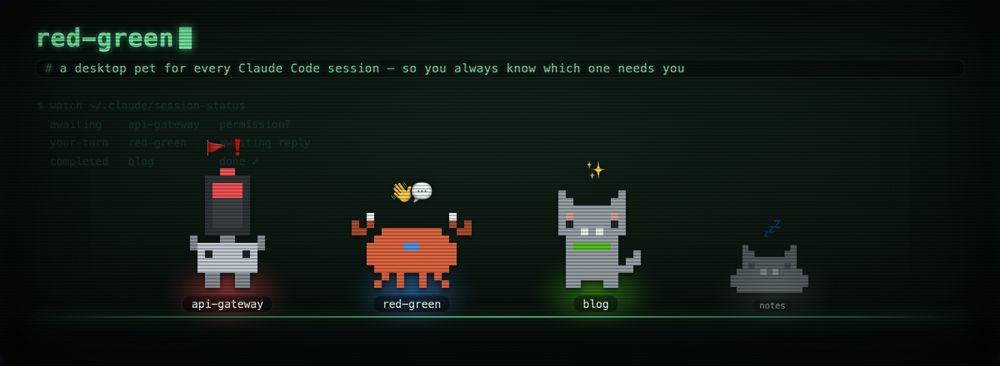
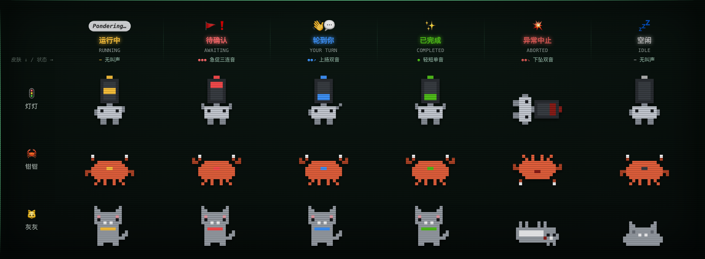

<p align="center">
  
</p>

<p align="center">
  <em>A desktop pet for every Claude Code session — so you always know which one needs you.</em>
</p>

<p align="center">
  
  
  
</p>

## 这是什么

同时开着好几个 Claude Code 会话，一旦切到别的窗口，就再也感知不到哪个在等你确认、哪个已经跑完、哪个挂了。

**red-green** 把每个本机会话变成一只常驻桌面、置顶于所有窗口的**像素宠物**，用**行为动画**告诉你会话此刻的**状态**——敲键盘 = 运行中，举牌跳 = 待确认，探头张望 = 轮到你，比耶 = 已完成，躺平 = 异常中止，睡觉 = 空闲。

- **一会话一宠物**，脚下**名牌**写着项目名；**皮肤**按项目名哈希分配（灯灯🚦 / 钳钳🦀 / 灰灰🐱），同一项目永远同一只——看形象就知是哪个项目。
- **点宠物**直接聚焦对应的 Terminal 标签页（Apple Terminal，tmux 也认）。
- 需要拉回注意力的状态还会**叫**：音色随皮肤（听声辨项目），节奏随状态（听节奏辨事件）；你正看着的那个会话不出声（**前台静默**）。

## 状态图鉴

<p align="center">
  
</p>

六个**会话状态**由回合边界处的 Claude Code hook 判定，驱动宠物的姿态、气泡与叫声。完整定义——含「轮到你」的问句启发式、「已阅」规则（聚焦终端即视为看到，但看到问题不等于回答了它）、前台静默——见 [CONTEXT.md](CONTEXT.md)。

## 安装与运行

```sh
./install.sh                 # 1. 装全局 hooks（对新启动的会话生效）
cd app && pnpm install       # 2. 前端依赖（仅 @tauri-apps/cli）
../scripts/install-app.sh    # 3. 构建 .app 装进 ~/Applications 并注册登录自启
```

开发迭代用 `pnpm tauri dev`（先退掉常驻版：`launchctl unload ~/Library/LaunchAgents/dev.y9g.red-green.plist`）。

首次运行时 macOS 会请求「自动化」权限（控制 Terminal 与 System Events）——点击聚焦与已阅检测靠它；`.app` 是独立应用身份，会各弹一次。

## 工作原理

```
hooks/session-status.sh    # Claude Code hook：把会话状态写进 ~/.claude/session-status/
scripts/merge-hooks.mjs    # 把 hook 配置幂等合并进 ~/.claude/settings.json（先备份）
app/
  ui/          manager（隐藏的逻辑中枢）+ pet（哑渲染器）+ sprites/skins/calls
  src-tauri/   Rust：文件 watcher + 命令（快照 / 窗口 / 聚焦 / 前台 tty / 叫声）
```

一句话链路：**hook 在回合边界写状态文件 → Rust watcher 感知变化 → manager 裁决皮肤 / 已阅 / 该不该叫 → 每只 pet 窗口哑渲染**。hooks 与 app 之间的契约见 [docs/protocol.md](docs/protocol.md)，关键架构决策见 [docs/adr/](docs/adr/)。

宠物形象与叫声都是预渲染、可重跑的：改皮肤看 `app/ui/sprites.js`，改叫声重跑 `scripts/gen-calls.mjs`，顶部这两张图重跑 `scripts/gen-readme-art.sh`。

## License

[MIT](LICENSE) © 2026 y9g
